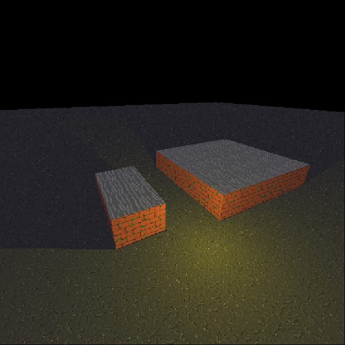

A software renderer in kotlin.

Features:
- dynamic lights
- dynamic shadows
- texturing
- multithread triangle rasterization

Controls:
- move: wasd + space + c
- rotate camera: arrows
- add a light source: enter
- exit: escape
- toggle acceleration mod: x

Author: Dmitry R

